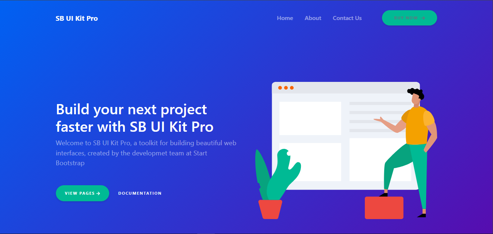
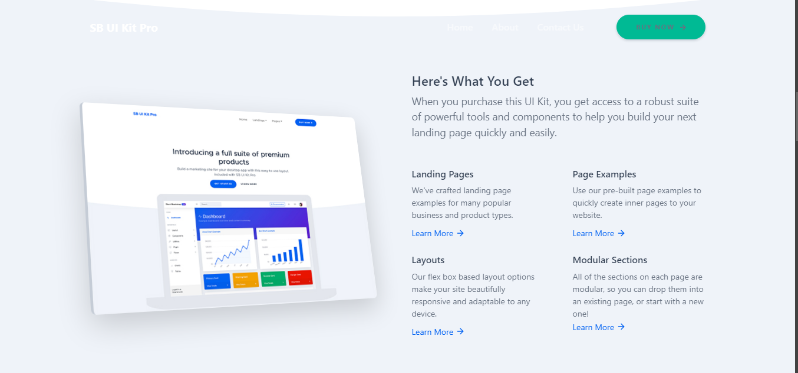
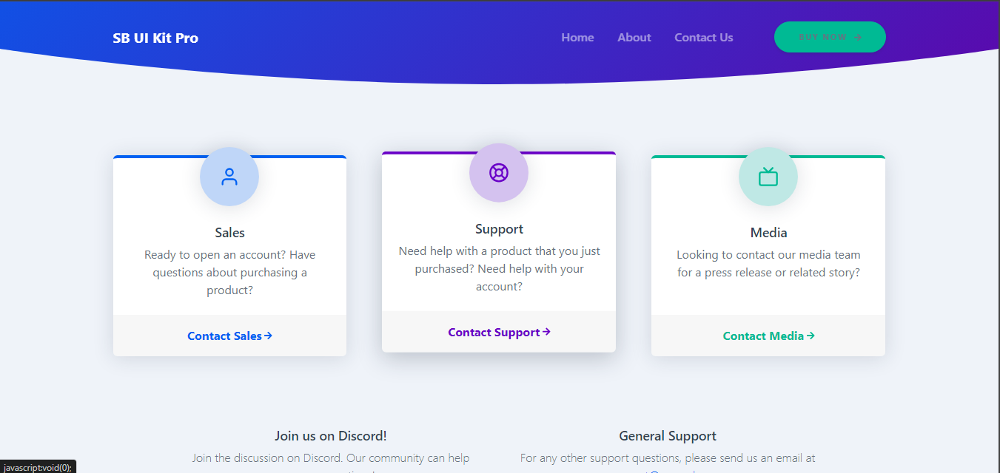

# Project-1("TechTide")
TechTide is a sleek, modern platform designed for tech enthusiasts and professionals. The homepage features a bold image slider and showcases featured blog posts in a stylish card format, covering topics like coding conferences and Python programming. With intuitive navigation and a clean design, TechTide offers a professional and engaging user experience, making it your go-to resource for the latest in technology.

# Project-2("furiLux")

Welcome to Furilux!
Discover the art of luxurious living with Furilux, your destination for world-class furniture design. Our carefully curated collections blend elegance with functionality, offering pieces that elevate every space. From timeless classics to modern masterpieces, Furilux brings you furniture that is crafted with precision and designed to inspire. Transform your home with our exquisite range, where comfort meets style.

# project("Sb kit web desgin")

This design features a responsive and visually engaging layout, ensuring a seamless experience on all devices. The bold gradient background enhances the modern look, while the well-structured content hierarchy directs attention to key elements like the headline and call-to-action buttons.

Optimal spacing and thoughtful alignment create a clean, organized interface that's easy to navigate. Vector illustrations add a dynamic touch, enhancing engagement without overwhelming the user. The typography is both readable and stylish, complementing the design's theme, while the consistent color scheme reinforces brand identity and ensures a cohesive visual flow.

Overall, this design perfectly balances aesthetics and functionality, offering a professional and polished user experience.
 

The "Contact" call-to-action links are prominently displayed, encouraging user interaction. The design is responsive, ensuring a seamless experience across all devices, and the overall aesthetic is modern and professional, making it easy for users to connect with the appropriate department efficiently.

